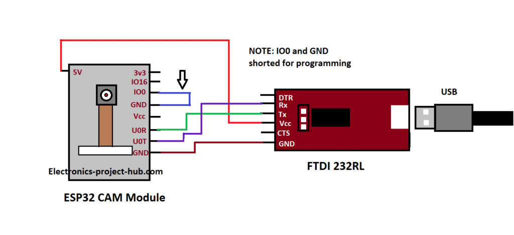
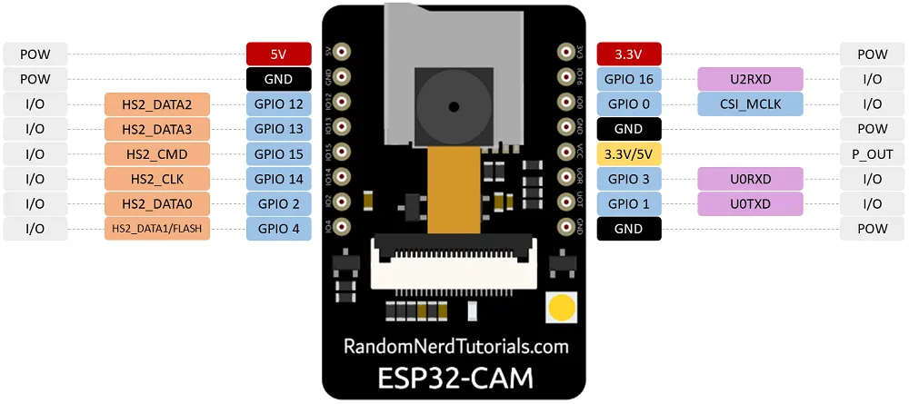
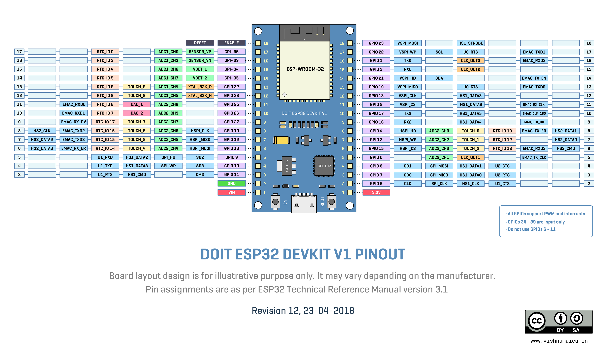

## ESP-32

### Powering

- LDO HT7333-A + 10µF low esr ceramic Caps
- [MCP1725T-3302E/MC](https://diyi0t.com/best-battery-for-esp32-nodemcu/)
- [Forum ](https://www.esp32.com/viewtopic.php?t=8451)

## ESP32-CAM

### Programming

**ESP32-CAM**

**#platformio.ini**

```
[env:esp32cam]
platform = espressif32
board = esp32cam
framework = arduino

upload_protocol = esptool

; change microcontroller
board_build.mcu = esp32

; change MCU frequency
board_build.f_cpu = 240000000L
```

### Pinout



### Links

- [ESP32-cam layout](ESP32_CAM_V1.6_layout.pdf)
- [Troubleshooting](https://randomnerdtutorials.com/esp32-cam-troubleshooting-guide/)
- [some nice tutorials and overview realy good](https://www.fambach.net/esp32-cam-modul/)
- [Setting camera parameter from the code](https://randomnerdtutorials.com/esp32-cam-ov2640-camera-settings/)

## ESP32-WROOM32

### Programming

**#platformio.ini**

```

```

### Pinout



### Links

- [ESP32 snippets](https://github.com/nkolban/esp32-snippets)
