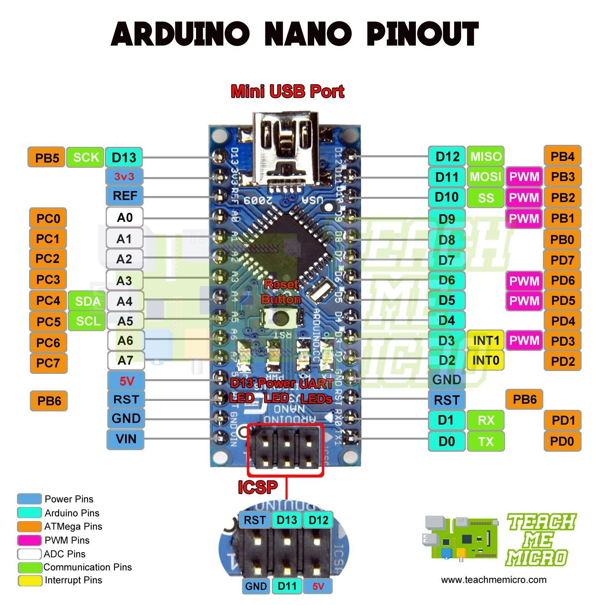

## Arduino Uno

### Layout


### Programming

```
#platformio.ini

```

### Links

- [emptylink]()

## Arduino Uno

### Layout


### Programming

```
#platformio.ini

```

### Links

- [emptylink]()

## Arduino pro mini

### Layout


### Programming

```
#platformio.ini

```

### Links

- [emptylink]()

## Arduino nano

### Layout



### Programming

```
#platformio.ini

```

### Links

- [emptylink]()